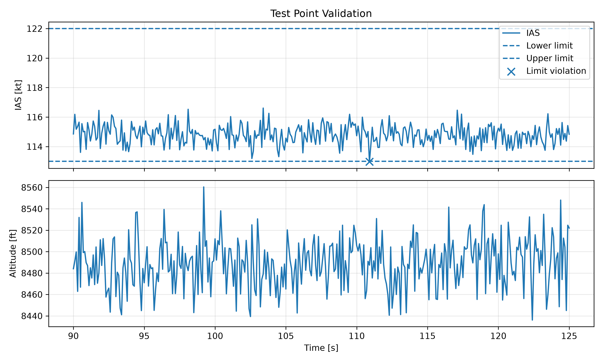
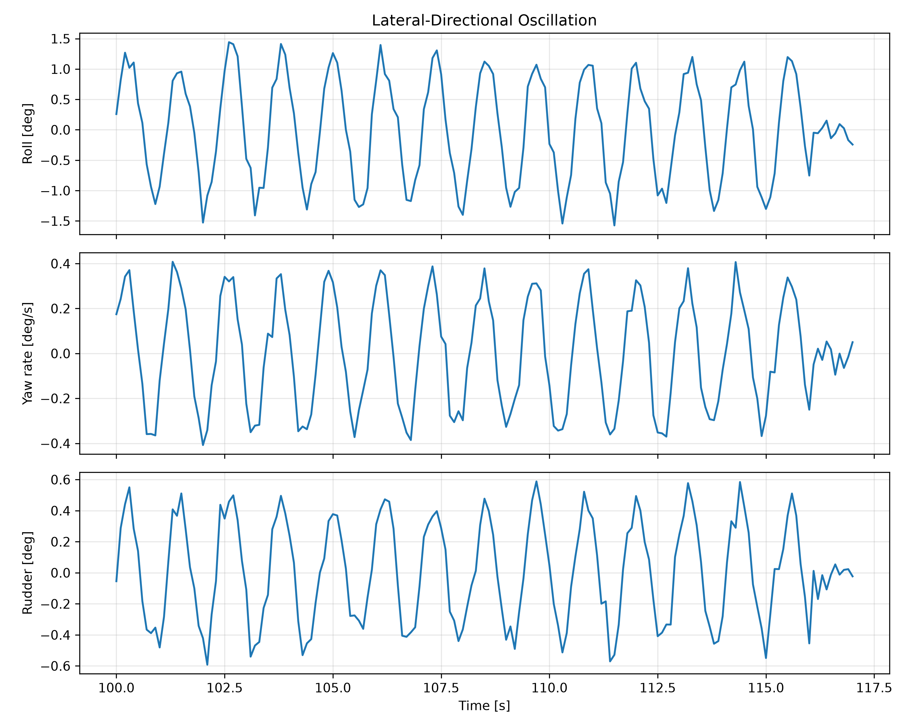

# Flight Test Data Analysis Toolkit

A Python-based engineering tool for the automated analysis of synthetic flight-test data.

The project implements a reproducible workflow for test-point validation, signal analysis, frequency-domain characterization, lateral-directional oscillation assessment, visualization, and automated reporting.

> **Note:** All flight data used in this repository are synthetic and are not associated with any real aircraft, company, or flight-test campaign.

## Overview

Flight-test analysis involves processing large amounts of time-series data to verify test conditions and characterize aircraft dynamic behavior.

This project explores how Python can be used to automate part of that workflow.

The tool loads a flight-test dataset, extracts a predefined test point, verifies operational limits, analyzes selected dynamic signals, and automatically generates engineering figures and a results report.

## Features

- Automated CSV flight-data ingestion
- Test-point extraction from time-series data
- Operational-limit validation
- Automatic identification of out-of-limit samples
- Peak-to-peak signal analysis
- Frequency-domain analysis using Fast Fourier Transform (FFT)
- Dominant-frequency estimation
- Cross-correlation between flight-dynamic signals
- Time-lag and phase-lag estimation
- Automated engineering plots
- Automated text-report generation
- Modular Python architecture

## Analysis Workflow

```text
Synthetic Flight-Test Data
            |
            v
      Data Ingestion
            |
            v
    Test-Point Selection
            |
            v
   Operating-Limit Check
            |
            v
     Signal Processing
      /           \
     v             v
Peak-to-Peak      FFT
Analysis       Frequency Analysis
     \             /
      v           v
     Cross-Correlation
            |
            v
    Engineering Figures
            |
            v
     Automated Report
```

## Test-Point Validation

The analyzed test point covers the interval from **90 s to 125 s**.

The tool automatically evaluates indicated airspeed against a specified operating range of **113–122 kt**.

For the synthetic dataset:

- Mean IAS: approximately **114.80 kt**
- Mean altitude: approximately **8488.9 ft**
- Number of IAS limit violations: **1**
- Out-of-limit sample: **110.9 s, 112.975 kt**



## Lateral-Directional Dynamic Analysis

A lateral-directional oscillatory event is analyzed between **100 s and 117 s** using roll angle, yaw rate, and rudder deflection.

The three signals exhibit a common dominant frequency of approximately **0.877 Hz**.

Calculated signal amplitudes:

- Roll peak-to-peak: approximately **3.02 deg**
- Yaw-rate peak-to-peak: approximately **0.82 deg/s**
- Rudder peak-to-peak: approximately **1.18 deg**

Cross-correlation between roll angle and yaw rate gives an estimated time lag of approximately **0.10 s**, corresponding to a phase difference of approximately **31.6 deg** at the dominant frequency.



## Project Structure

```text
flight-test-data-analysis/
|
|-- data/
|   `-- flight_test_simulation_02.csv
|
|-- notebooks/
|   |-- flight_analysis.ipynb
|   `-- flight_analysis_02.ipynb
|
|-- reports/
|   |-- figures/
|   |   |-- lateral_directional_oscillation.png
|   |   `-- test_point_validation.png
|   `-- flight_test_report.txt
|
|-- src/
|   |-- analysis.py
|   |-- visualization.py
|   `-- reporting.py
|
|-- main.py
|-- requirements.txt
|-- README.md
`-- .gitignore
```

## Installation

Clone the repository:

```bash
git clone https://github.com/polmg027/flight-test-data-analysis.git
cd flight-test-data-analysis
```

Install the required Python packages:

```bash
pip install -r requirements.txt
```

## Usage

Run the complete analysis pipeline:

```bash
python main.py
```

The program automatically:

1. loads the synthetic flight-test dataset,
2. extracts the selected test point,
3. validates operating conditions,
4. performs dynamic signal analysis,
5. generates engineering figures, and
6. exports an analysis report.

## Technologies

- Python
- pandas
- NumPy
- Matplotlib
- Jupyter
- Git / GitHub

## Engineering Methods

The project applies several methods commonly used in engineering time-series analysis:

**Fast Fourier Transform (FFT)** is used to transform signals from the time domain into the frequency domain and estimate their dominant oscillatory frequency.

**Cross-correlation** is used to estimate the relative time displacement between dynamic signals.

**Peak-to-peak analysis** provides a simple measure of oscillation amplitude.

**Limit validation** automatically detects samples that fall outside predefined test-point conditions.

## Future Development

Potential extensions include automatic test-point detection, additional flight-dynamics metrics, configurable analysis parameters, automated PDF reporting, and support for multiple test maneuvers.

## Disclaimer

This is an independent educational engineering project developed using synthetic data. It does not contain proprietary, confidential, or operational flight-test data from any aerospace company or aircraft program.